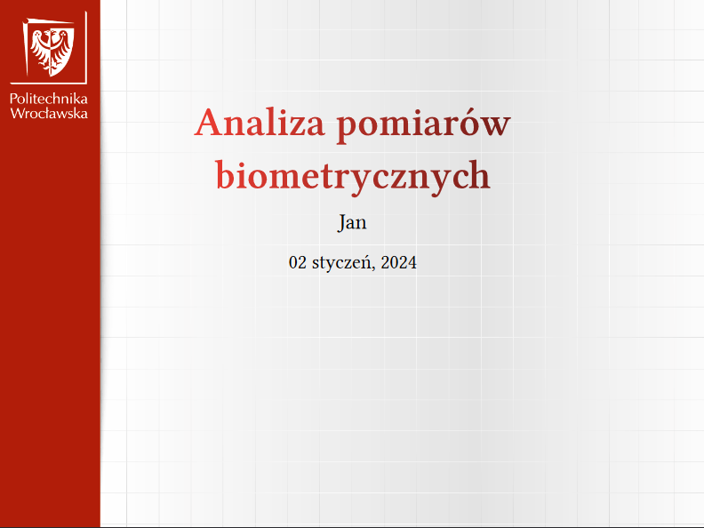
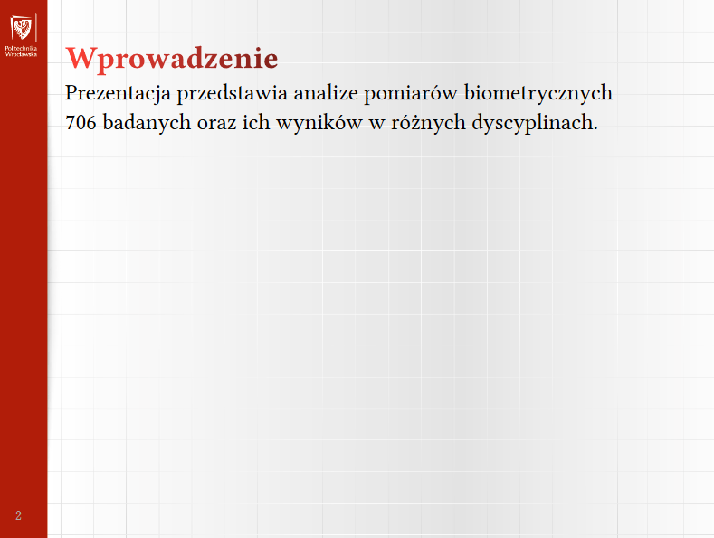

# pwr-typst
Typst [Polylux](https://github.com/andreasKroepelin/polylux "Polylux github") PWr template

# Requirements
polylux (tested working with version 0.3.1)


# Usage

Example 1.
```typst
#import "@preview/polylux:0.3.1": *
#import "pwr.typ": *

#let today = datetime.today()

#let month = "styczeń" // default "[month repr:long]", it sadly doesn't support language localization yet https://typst.app/docs/reference/foundations/datetime

#show: pwr-theme.with(author: "Jan", date: today.display("[day] month, [year]".replace("month", month)), lang: "en") // defaults: "pl"
#title-slide(title: "Analiza pomiarów biometrycznych")

#slide[
  = Wprowadzenie
  Prezentacja przedstawia analize pomiarów biometrycznych 706 badanych oraz ich wyników w różnych dyscyplinach.
]
```
Preview:



